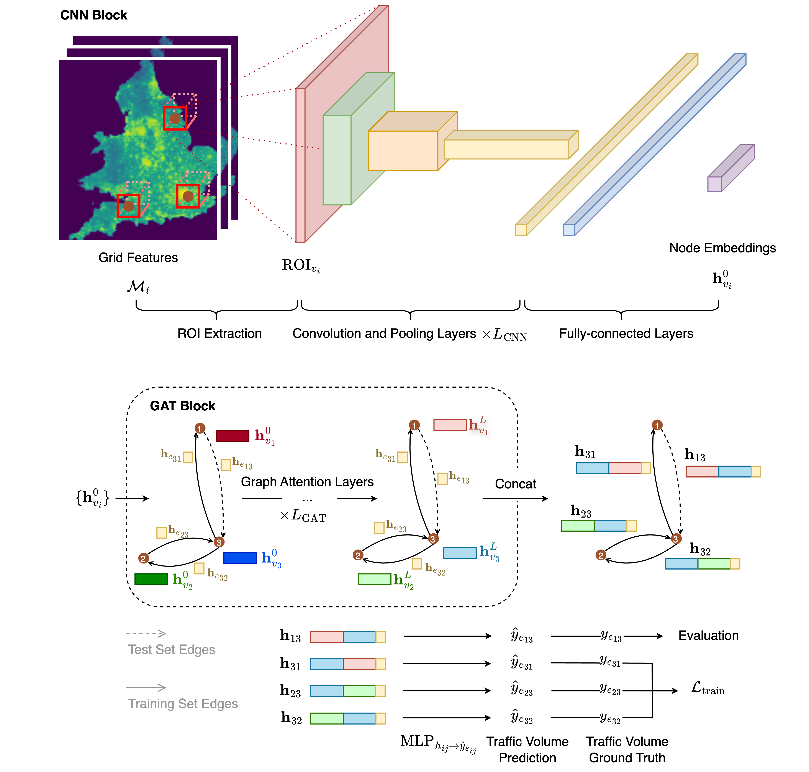

# Mukara: A Deep Learning-Based Model for Interurban Highway Traffic Volume Prediction Using External Socioeconomic Drivers



This repository contains the TensorFlow implementation of **Mukara**, as described in the following paper:

- Yue Li, Shujuan Chen, Ying Jin. _Mukara: A Deep Learning-Based Model for Interurban Highway Traffic Volume Prediction Using External Socioeconomic Drivers_

---

## Requirements for Reproducibility

### System Requirements

- **Operating System**: Windows 11 OS
- **Programming Language**: Python 3.9.18
- **Hardware**: A single NVIDIA RTX 4090 GPU

### Key Library Dependencies

- `numpy` 1.25.2
- `pandas` 2.0.3
- [TensorFlow 2.10.1](https://www.tensorflow.org/install/pip?_gl=1*1tk6s5m*_up*MQ..*_ga*MjI3MzQyMDc1LjE3MTM2OTIwNzI.*_ga_W0YLR4190T*MTcxMzY5MjA3MS4xLjAuMTcxMzY5MjA3MS4wLjAuMA..#windows-native)
- `cudatoolkit` 11.2.2
- `cudnn` 8.1.0.77
- [DGL 1.1.2+cu118](https://www.dgl.ai/pages/start.html)

**Note**: Manual installation of the dependencies is recommended. After installation, update the backend deep learning framework for DGL to TensorFlow.

---

## Data Description

### Highway Network
- **Files**:
  - `edge_features.csv`: Official edge features file used by the model.
  - `node_coordinates.csv`: Node coordinates for the highway network.
  - `sensors_498.csv`: Original file for highway trunk road setup.
  - Deprecated files: `download_edge_features_ors.ipynb`, `edge_features_json_ors`, `edge_features_ors.csv` (from OpenRouteService API).
  - Current method: `download_edge_features_google.ipynb` (uses Google Routes API).

### Land Use and POI
- **Process**:
  1. Download raw `.pbf` files and subregion geometries using `download_pbfs_polys.ipynb`.
  2. Extract 12 land use and POI features for each subregion with `data_cleaning_land_use_poi-local.py`.
  3. Aggregate individual grid results into `landuse_and_poi-230101.h5` using `aggregate_by_index.ipynb`.
- **Deprecated**:
  - `data_cleaning_land_use_poi-ohsome.py` (Ohsome API-based process, too time-consuming).

### Population and Employment
- **Population**:
  - `population_raw_data_from_download.csv`: Raw data from NOMIS, split by strata using `split_raw_data.ipynb`.
  - Rasterized to grids using `population_tensor_generation.py`, resulting in `population_tensor.h5` (shape: 8 × 653 × 573 × 10).
- **Employment**:
  - `raw_data_from_download`: Raw data split into strata with `split_raw_data.ipynb`.
  - Rasterized with `employment_tensor_generation.py`, resulting in `employment_tensor.h5`.
- **Merged Data**:
  - Combined population and employment data into `population_and_employment.h5` using `population_and_employment_merge.ipynb` (shape: 8 × 653 × 573 × 94).

### Traffic Volume
- **Raw Data**:
  - Downloaded using `download_GT.ipynb` and stored in `Highway_2015-2023_498sensors`.
- **Processed Data**:
  - Cleaned and averaged into `average_daily_volumes_2015-2022.h5` using `data_cleaning-traffic_volume.ipynb`.

---

## Code Description

### Folder Structure

- `data/`: Stores data files for highway network, land use and POI, population and employment, and traffic volume.
- `eval/`: Contains logs and evaluation scripts:
  - `evaluate_log.py`: Reads loss logs.
  - `inference.ipynb`: Performs predictions using a trained model.
  - `loss_eval.ipynb`: Plots training loss curves.
  - `map_loss.ipynb`: Visualizes sensor-wise prediction losses on maps.
- `model/`: Contains model scripts:
  - `dataloader.py`: Loads preprocessed datasets.
  - `utils.py`: Helper functions, including metrics.
  - `graph_*.py`: Various model architectures for Mukara.
- `param/`: Stores trained model parameters.
- `config.py`: Configuration file for model hyperparameters (modifiable).
- `config-template.py`: Template for generating `config.py` during batch training.
- `train.py`: Main script for training a single model.
- `train_batch.ipynb`: Automates multiple training runs with varying hyperparameters.

### Training Process
1. Modify hyperparameters in `config.py` or use `config-template.py` for batch training.
2. Train a single model using:
   ```bash
   python train.py
   ```
3. For batch training, use `train_batch.ipynb` to sequentially run multiple configurations.

## Citation
If you find this repository useful for your research, please cite our paper:
   ```bibtex
   @article{mukara2025,
   author    = {Yue Li and Shujuan Chen and Ying Jin},
   title     = {Mukara: A Deep Learning-Based Model for Interurban Highway Traffic Volume Prediction Using External Socioeconomic Drivers},
   journal   = {To be updated with journal information},
   year      = {2025},
   }
   ```

## License
This project is licensed under the MIT License. See the LICENSE file for details.